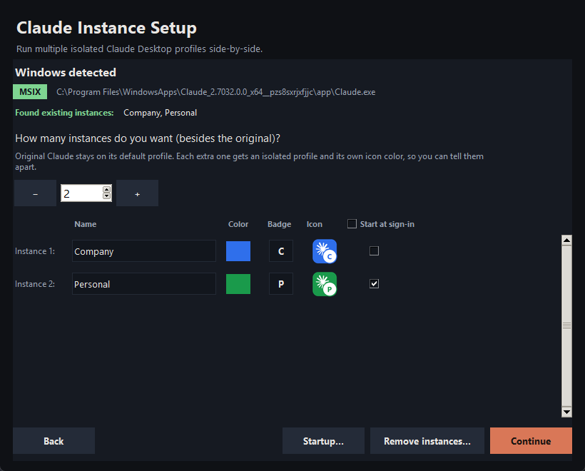
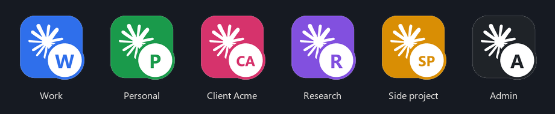
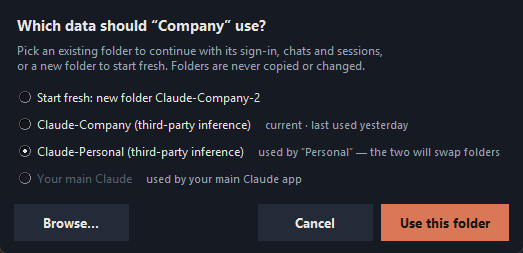

# Claude Multi-Instance

Run **several Claude Desktop accounts side by side** on one computer. Each
instance has its own profile (sign-in, chats, settings), its own **colored
icon**, and its own name, so you always open the right one.



> [!IMPORTANT]
> This is an independent community tool. It is **not affiliated with, endorsed
> by, or supported by Anthropic**. On Windows it runs your extra instances from
> a **modified copy** of Claude Desktop (your original install is never
> changed). Anthropic does not support modified copies, so updates to Claude
> may break it until this tool is updated. Use it at your own risk, and check
> your organization's policies before using it on a managed computer.

## Download

Get the latest version from **[Releases](https://github.com/Dipson-bot/claude-multi-instance/releases/latest)**:

| System | File | How to start |
|---|---|---|
| Windows 10/11 | `Claude-Multi-Setup-v1.5-Windows.zip` | Unzip, double-click `Claude-Multi-Setup.exe` |
| macOS | `Claude-Multi-Setup-v1.5-macOS.zip` | Unzip, run `bash start-mac.sh` in Terminal ([guide](MAC-QUICKSTART.md)) |

Windows may say *"Windows protected your PC"* because the exe is not code-signed
yet: click **More info → Run anyway**.

## Features

- **Any number of isolated instances**, each with its own sign-in, chats and settings.
- **Continue an existing Claude**: point an instance at a folder that already has data, so it keeps its sign-in, chats and sessions. Renaming an instance keeps its data.
- **Colored icons with a badge** (e.g. a blue **W** for "Work"), with a palette or custom color, and a live preview.
  - Windows: on the desktop shortcut, the taskbar button and the window.
  - macOS: on the instance's app (Spotlight, Launchpad, Dock).
- **Instance name in the window title** (Windows): `Claude — Work`.
- **Separate taskbar buttons** per instance (Windows); pinned instances keep their colored icon.
- **Start menu entries** (Windows): open an instance by typing its name in Windows search.
- **Open by name on macOS**: each instance is its own app (`Claude Work.app`), found with Spotlight.
- **Start at sign-in**, per instance or all at once; shows up in Task Manager → Startup apps.
- **Update reminder** (Windows): after Claude updates, you're asked at sign-in whether to update your instances.
- **Remove instances or uninstall everything**, with optional data deletion to the Recycle Bin/Trash so it can be restored.
- **Safe updates**: the new copy is self-tested before it replaces the old one, and a failed update leaves the working copy untouched.
- **No Node.js or admin rights needed.**



## Quick start

### Windows
1. Install Claude Desktop from the Microsoft Store and close it.
2. Run `Claude-Multi-Setup.exe`.
3. Choose how many extra instances you want, and set their names, colors and badges. Tick **Start at sign-in** if you like.
4. Click **Continue → Install**. It takes about a minute; a Claude window may appear briefly during the self-test.
5. Open each colored **desktop shortcut** and sign in with a different account.

### macOS
See **[MAC-QUICKSTART.md](MAC-QUICKSTART.md)**. In short: install Python from
python.org, unzip, then run `bash start-mac.sh`. Each instance appears as its own
app in `~/Applications` (e.g. **Claude Work**), which you can open with Spotlight.

## How it works

Claude Desktop is an Electron app. Two instances can run together only if each
uses its own *user data directory*.

- **Windows.** The Store build forces its data folder back to `Claude-3p`, so a
  plain `--user-data-dir` doesn't work. The tool builds **one patched copy** in
  `%USERPROFILE%\ClaudeInstances\app` (pure Python, no Node.js):
  - it disables that relocation and keeps `CLAUDE_USER_DATA_DIR`;
  - it adds a small launch shim, which applies the instance's window title, icon and taskbar identity;
  - it switches off the copy's asar-integrity fuse.
  The copy is **self-tested** on a throwaway profile before it's installed.
  Every instance runs from this copy with its own `--user-data-dir`.
- **macOS.** No patching is needed. Each instance is a tiny launcher app that
  runs `open -na Claude --args --user-data-dir=…`. A running instance shows
  Claude's normal Dock icon.

Profiles live in `%LOCALAPPDATA%\Claude-<Name>` (Windows) or
`~/Library/Application Support/Claude-<Name>` (macOS).

## Continue an existing Claude instead of starting fresh

Each instance keeps its data in its own profile folder. Under every instance
the setup window shows which folder it uses:

- **"Continues existing profile …"**: the folder already has data. The
  instance opens signed in, with its local chats, Claude Code / Cowork sessions
  and settings, exactly where you left off.
- **"New profile … starts fresh"**: an empty folder; sign in as new.

Click **Profile…** to choose a different folder: another existing Claude
folder, **Start fresh** (a new, empty folder), or any location via
**Browse…**. Choosing a folder another instance uses **swaps** the two
instances' folders. Folders are never copied or changed. Renaming an
instance keeps its folder and data.



Notes:
- **Your main Claude** (opened from the normal Claude icon) always keeps its
  own data and is never changed. Its folder can't be given to an instance,
  because two Claudes cannot open one folder at the same time.
- On Windows the Microsoft Store Claude stores its data in
  `%LOCALAPPDATA%\Packages\Claude_pzs8sxrjxfjjc\LocalCache\Roaming\Claude`
  rather than `%APPDATA%\Claude`; the tool knows this.
- Chats of a claude.ai account are stored online and appear in any instance
  signed in to that account. Third-party inference setups (e.g. a gateway) and
  Claude Code / Cowork sessions are stored **locally** in the profile folder,
  so keep using the same folder to keep them.

## After a Claude update

- **Windows:** the Store updates the original Claude. The instances keep
  running the version they were built from until you update them. With the
  reminder on, you're asked after your next sign-in; otherwise re-run the tool
  and click Install. Close the extra instances first. Profiles are kept.
- **macOS:** nothing to do. The instances use the updated Claude automatically.

## Start at sign-in

Tick **Start at sign-in** per instance in the setup window (the column header
toggles all), or click **Startup…** to change it for existing instances instantly.
Windows uses your Startup folder (visible in Task Manager → Startup apps);
macOS uses a login item per instance.

## Removing instances

Click **Remove instances…**, tick the instances, and choose:
- **Default:** removes the shortcuts/apps, launchers and icons. The profile is kept, so re-adding an instance with the same name restores its sign-in.
- **Also delete their data:** the profile goes to the **Recycle Bin / Trash**.
- **Full uninstall** (all instances ticked): also removes the patched copy and the update reminder.

Your original Claude and your claude.ai accounts are never touched.

## Command line

```text
Claude-Multi-Setup.exe                          setup window (default)
Claude-Multi-Setup.exe --cli "Work,Personal"    set up without a window
Claude-Multi-Setup.exe --repair                 rebuild the patched copy for existing instances
Claude-Multi-Setup.exe --list                   list instances and who starts at sign-in
Claude-Multi-Setup.exe --startup-on "Work"      start at sign-in ("all" for every instance)
Claude-Multi-Setup.exe --startup-off all
Claude-Multi-Setup.exe --remove "Work"          remove (add --delete-data to also trash its profile)
Claude-Multi-Setup.exe --uninstall              remove everything
Claude-Multi-Setup.exe --no-update-check        (with --cli/--repair) no sign-in update reminder
```
On macOS use `bash start-mac.sh <options>`. The Windows exe is a windowed app, so
it prints nothing in a terminal; run from source (`python run.py …`) to see
command-line output.

## Build from source

Requires Python 3.10+ with Tkinter.

```bash
pip install -r requirements.txt
powershell -ExecutionPolicy Bypass -File build\build_windows.ps1   # Windows → dist\Claude-Multi-Setup.exe
bash build/build_macos.sh                                          # macOS  → dist/Claude Multi Setup.app
python build/package_release.py v1.5                               # release zips → release/
```
Or run directly: `python run.py`.

## Known limitations

- The Windows exe is not code-signed (SmartScreen warning). Antivirus software may flag a tool that modifies another app's files.
- macOS: a *running* instance shows Claude's normal Dock icon; the colored icon is on the launcher app.
- Several instances starting at sign-in each load a full Claude app, so sign-in can be slower on low-end PCs.
- Signing in through a browser link (`claude://`) is handled by whichever Claude is registered for it; check sign-in works for each instance.
- Standalone (non-Store) Windows installs and Linux are not fully tested.

## Troubleshooting

| Problem | Fix |
|---|---|
| "Claude process(es) are running from the patched copy" | Close all extra Claude windows (check the tray), then retry. |
| "Self-test failed" / "Could not locate the relocation code" | This Claude version changed its startup code. Your current instances keep working; wait for an updated version of this tool. |
| A second instance only focuses the first one | Use the tool's shortcut/app for that instance, not the original Claude. |
| Old taskbar pin opens the wrong thing | Unpin it and pin the new colored shortcut. |
| Icons are plain Claude icons | Pillow was missing when building; `pip install -r requirements.txt` and rebuild. |

## Project layout

```text
app/
  main.py            command-line options, starts the setup window
  gui.py             Tkinter setup window
  core/
    platform.py      OS detection, Claude discovery, name validation, instance list
    asar.py          pure-Python asar reader/writer + Electron fuse flip
    asar_patch.py    Windows patch, launch shim, self-test, safe swap
    icons.py         colored instance icons (Pillow)
    launcher.py      shortcuts (.lnk) / macOS launcher apps / Linux launchers
    startup.py       start at sign-in
    update_check.py  Windows sign-in update reminder
    remove.py        remove instances / uninstall
    setup.py         orchestration
build/               build scripts (PyInstaller) and release packaging
docs/                install notes shipped with the Windows download, screenshots
```

## Versions

See [CHANGELOG.md](CHANGELOG.md). v1.0 and v1.1 are outdated and have a bug
that stops the setup window from opening; use the latest version.
